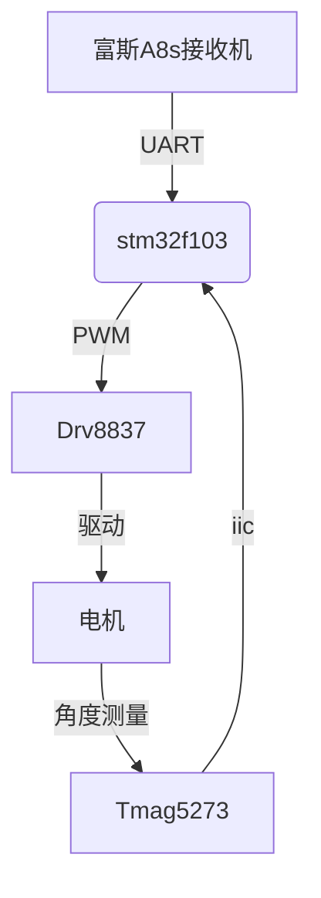

# 基于stm32开发的仿生蝴蝶项目

电机版系统框图

```mermaid
graph

A(stm32f103)
B[Tmag5273]
C[Drv8837]
D[富斯A8s接收机]
E[电机]

B --> |iic| A
D --> |UART| A
A --> |PWM| C
C --> |驱动| E
E --> |角度测量| B

```
整块 PCB板自主设计焊接.目前使用stm32c8t6作为主控,通过PWM信号经过drv8837驱动来使能电机. 且在闭环模式下,可通过Tmag5273磁编码器反馈电机转动的角度经过Pid算法对电机进行闭环控制.